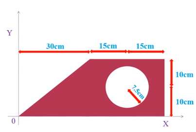
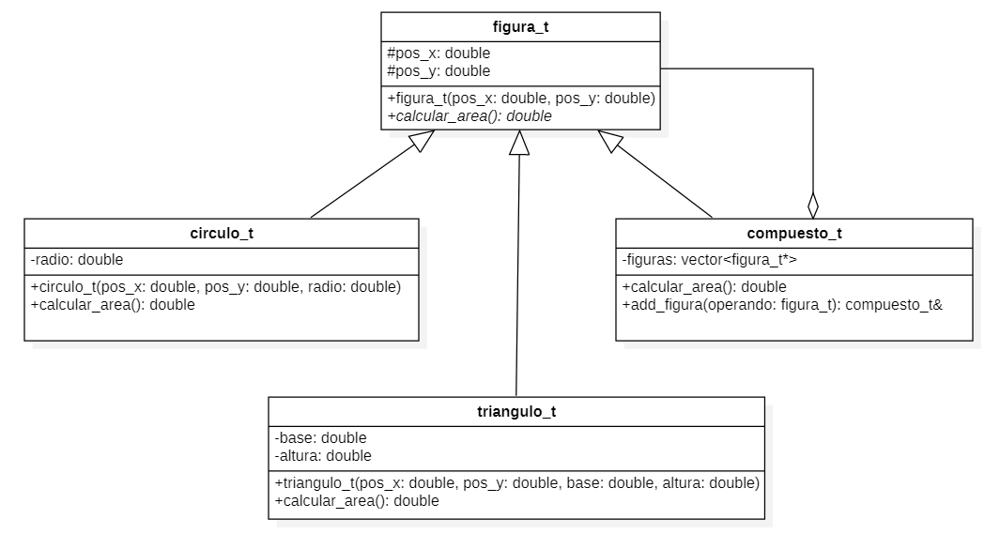

# PC #3 - 2021-1 - Lab 101

Práctica Calificada # 3 del curso de Programación Orientada a Objetos 1

## Indicaciones Específicas
- El tiempo límite para la evaluación es 100 minutos.
- Las preguntas deberá ser respondida en un archivo fuente (`.cpp`) y un archivo cabecera (`.h`) con el número de la pregunta:
    - `p1.cpp, p1.h`
- Deberás subir estos archivos directamente a [www.gradescope.com](https://www.gradescope.com) o se puede crear un `.zip` que contenga todos ellos y subirlo.

## Competencias
- Para los alumnos de la carrera de Ciencia de la Computación
    - Aplicar conocimientos de computación y de matemáticas apropiadas para la disciplina. **(Evaluar)**
    - Analizar problemas e identificar y definir los requerimientos computacionales apropiados para su solución. **(Usar)**
    - Utilizar técnicas y herramientas actuales necesarias para la práctica de la computación. **(Usar)**

- Para los alumnos de las carreras de Ingeniería
    - Capacidad de aplicar conocimientos de matemáticas **(nivel 3)**
    - Capacidad de aplicar conocimientos de ingeniería **(nivel 2)**
    - Capacidad para diseñar un sistema, un componente o un proceso para satisfacer las necesidades deseadas dentro de restricciones realistas. **(nivel 2)**

### Pregunta #1 - Áreas Compuestas - 20 puntos

### Problem Statement
Implementar un programa orientado a objetos que permite calcular el área plana compuesta como la que se muestra a continuación:



- La impresión del área de la figura compuesta debe realizarse por medio de la sobrecarga del operador desplazamiento a la izquierda **(ver ejemplo)**.
- Agregar a la clase `compuesto_t` la sobrecarga del operador incremento (`+=`) basándose en el método `add_figura` de la misma clase *(ver diagrama)* 
```
ostream& operator <<(ostream& out , compuesto_t  comp);
```


**Nota:** El programa debe permitir calcular el área de figuras compuestas **solo** como las que se muestra en la imagen.
**Sugerencias:** Basarse en el diagrama de clases mostrado a continuación y agregar al programa la clase rectángulo:

### Input Format
```cpp
  T 0 0 30 20
  R 30 0 30 20
  C 37.5 2.5 7.5
```
### Constraints
```bash
- No utilizar etiquetas
- Numeros enteros o con decimales
```

### Output Format
```bash
  723.285
```

